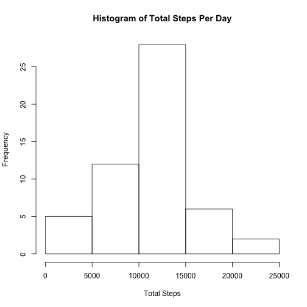
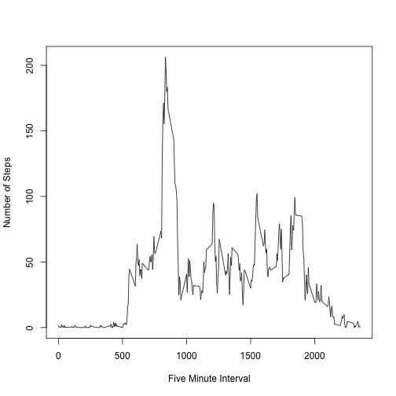
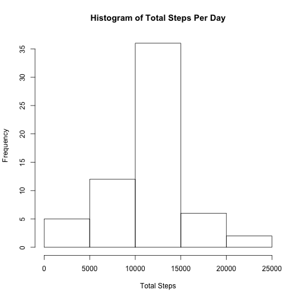
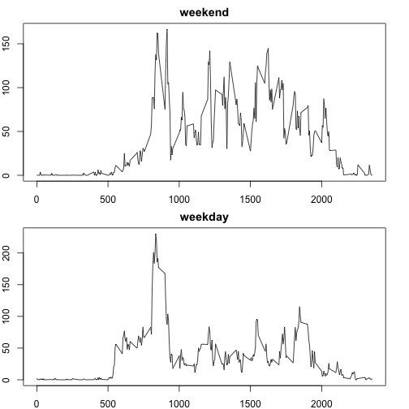

## Loading and preprocessing the data

The file is composed of "steps","date","interval" in a csv file.


```r
rawdata<-read.csv("activity.csv")
# convert date
rawdata$date<-as.Date(rawdata$date)
# reset plotting system
dev.off()
```

```
## null device 
##           1
```


## What is mean total number of steps taken per day?

Ignore missing data, aggregate number of steps by date, draw
histogram and compute mean and median.


```r
data<-rawdata[complete.cases(rawdata),]
datesum<-aggregate(x=data$steps,FUN=sum, by = list(date=data$date))
colnames(datesum)<-c("date","totalsteps")
hist(datesum$totalsteps, main="Histogram of Total Steps Per Day",
     xlab="Total Steps")
```

 

```r
cat("Mean Steps per Day: ",mean(datesum$totalsteps))
```

```
## Mean Steps per Day:  10766.19
```

```r
cat("Median Steps per Day: ",median(datesum$totalsteps))
```

```
## Median Steps per Day:  10765
```

## What is the average daily activity pattern?

Find the average number of steps in each 5 minute interval.  Generate a
time series plot.  Find the maximum number of steps in any interval.


```r
intervalmean<-aggregate(x=data$steps,FUN=mean,by=list(interval=data$interval))
colnames(intervalmean)<-c("interval","steps")
plot(intervalmean$interval,intervalmean$steps,type="l",ylab="Number of Steps",
        xlab="Five Minute Interval")
```

 

```r
cat("Max Average Step Interval: ",which.max(intervalmean[,2]),
                                            "Value: ",max(intervalmean$steps))
```

```
## Max Average Step Interval:  104 Value:  206.1698
```

## Inputing missing values

1. Calculate and report the total number of missing values in the dataset
(the total number of rows with NA).
2. Fill in missing values using mean per interval.
3. Create a new dataset equal to the original data set but with missing
values filled in.
4. Make a histogram of total number of steps taken each day and report
the mean and median total number of steps per day.


```r
cat("Total number of rows with NA",sum(!complete.cases(rawdata)))
```

```
## Total number of rows with NA 2304
```

```r
fillin<-rawdata
missingrows<-is.na(fillin$steps)
for (n in 1:length(missingrows)) {
        if (missingrows[n]) {
                # get the row in the interval's mean
                meanrow<-intervalmean$interval==fillin[n,3]
                # get the value of the mean
                v<-intervalmean[meanrow,2]
                # reset the NA to be the mean value of the interval
                fillin[n,1]=v
                }
}
fillinsum<-aggregate(x=fillin$steps,FUN=sum, by = list(date=fillin$date))
colnames(fillinsum)<-c("date","totalsteps")
hist(fillinsum$totalsteps, main="Histogram of Total Steps Per Day",
     xlab="Total Steps")
```

 

```r
cat("Filled-in Mean Steps per Day: ",mean(fillinsum$totalsteps))
```

```
## Filled-in Mean Steps per Day:  10766.19
```

```r
cat("Filled-in Median Steps per Day: ",median(fillinsum$totalsteps))
```

```
## Filled-in Median Steps per Day:  10766.19
```

The mean shows no change.  The median is nearly the same.  Thus, filling in
the interval means for the missing data has almost no effect.

## Are there differences in activity patterns between weekdays and weekends?

Create a new factor variable in the dataset with two levels - "weekday"
and "weekend" indicating whether a given data is a weekend.

Make a time series plot of 5-minute interval (x-axis) and average
number of steps taken, averaged across all weekday days or
weekend days.


```r
fillin$weekend<-weekdays(fillin$date)=="Saturday" | weekdays(fillin$date)=="Sunday"
fillin$weekday<-!fillin$weekend
fillinintervalmean<-aggregate(x=fillin$steps,FUN=mean,                        by=list(interval=fillin$interval,weekend=fillin$weekend,weekday=fillin$weekday))
colnames(fillinintervalmean)<-c("interval","weekend","weekday","steps")
par(mfrow=c(2,1),mar=c(2,2,2,2))
fimwe=fillinintervalmean[fillinintervalmean$weekend,]
fimwd=fillinintervalmean[fillinintervalmean$weekday,]

plot(fimwe$interval,
        fimwe$steps,
        type="l",
        main="weekend",
        ylab="Number of Steps",
        xlab="Five Minute Interval")

plot(fimwd$interval,
        fimwd$steps,
        type="l",
        main="weekday",
        ylab="Number of Steps",
        xlab="Five Minute Interval")
```

 

There is definitely a difference in activity between weekends and weekdays, as
the plots above show.
